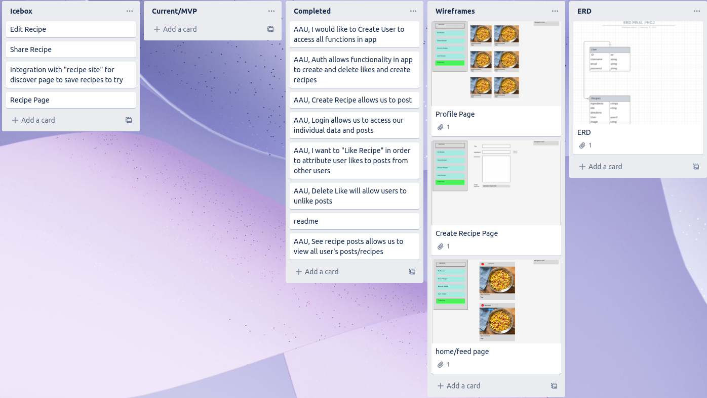
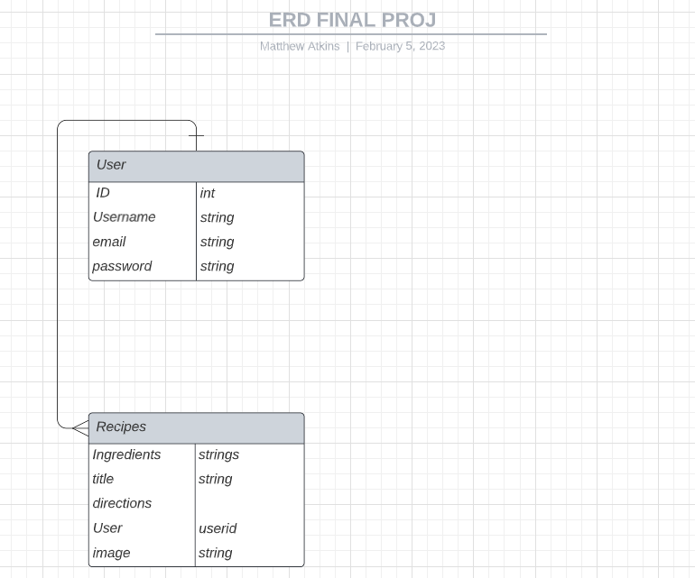

# Recipe Book
Created by: Matthew Atkins
- - -
"Launch Recipe Book here"
https://odd-plum-clam-vest.cyclic.app/
- - -
## Recipe Book Overview:
- - -
Users on Recipe Book will be able to upload a photo of their recipe and give step-by-step instructions and ingredients for their recipe! As long as users separate their steps and ingredients by commas, it will be formatted in a way that is easy to read in each post. A user can like other user's recipes and view their profiles full of recipes.

## How To Use/Wireframe (Images Attached):
- - -
1. Homepage/Landing Page:(public/home.png)
    This will be your feed where you can view other users' posts along with your own. You can like recipes on this page. You will also be able to post your own recipes from here.

2. Profile Page:
    This page will display all of your own recipes that you have posted. It includes your bio snippet and photo.

3. Signup Page:
    Signup is simple with username, email, password, password confirm, and profile picture

4. Login Page: 
    At login you will enter your email you signed up with and password in order to create posts and like recipes.
  

## Trello:
- - -

https://trello.com/b/dI31QbTy/project-4

## ERD:
- - -

##  Technologies Used:
- - -
MongoDB, Express, React, Node, Semantic UI

##  Next Steps for the Future:
- - -
 In the future I would like to:
   1. Save recipes from other Users to a personal recipe book
   2. Have recipes that are private and can't be viewed publicly
   3. Edit recipes
   4. Delete recipes
   5. Share recipe
